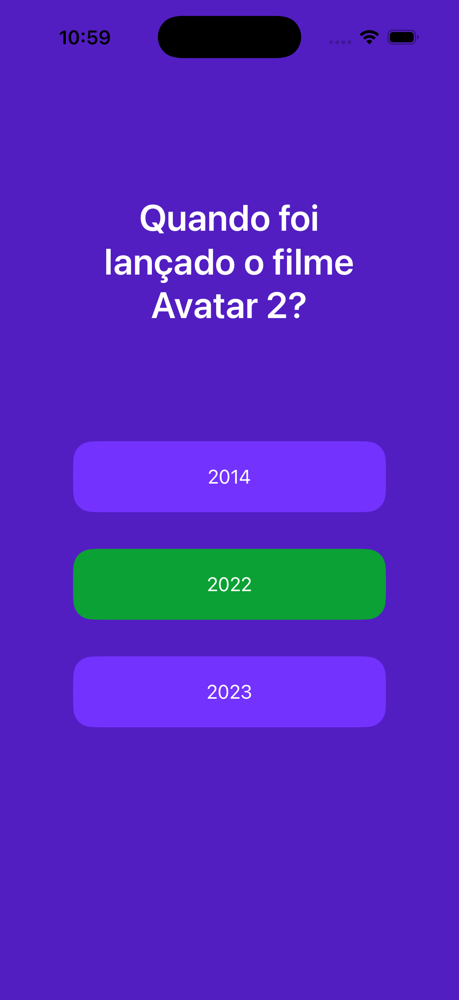

## Sobre

iQuiz é um app que permite ao usuário responder perguntas de múltipla escolha e testar seus conhecimentos de forma interativa.  
O objetivo deste projeto é demonstrar habilidades em desenvolvimento iOS com Swift, Xcode, navegação entre telas e organização de código.

## Funcionalidades

- Quiz com perguntas de múltipla escolha  
- Mostra o resultado final ao término do quiz  
- Interface simples e direta construída com UIKit  
- Conceitos de navegação e gerenciamento de telas

## Tecnologias

Este projeto foi construído com:

- **Swift 5**
- **UIKit**
- Xcode
- Arquitetura básica MVC

## O que aprendi

- Navegação entre telas com UIKit

- Organização de views e controllers

- Lógica básica de fluxo de perguntas/respostas

- Gerenciamento de estado simples

## Screenshots

Fluxo principal do aplicativo, desde o início do quiz até a exibição do resultado final.

  
  
  
  

